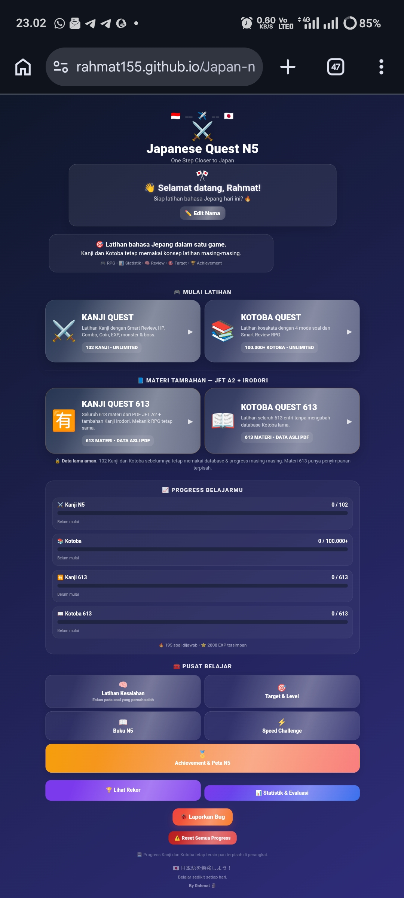
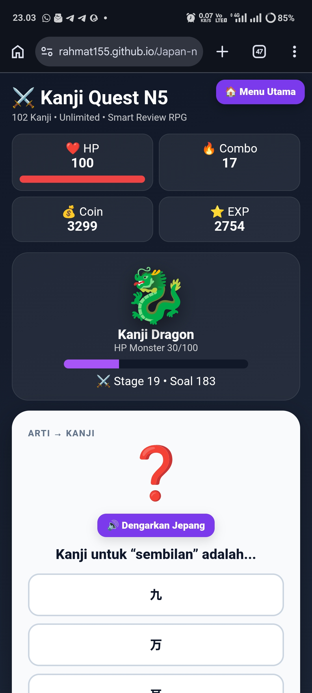
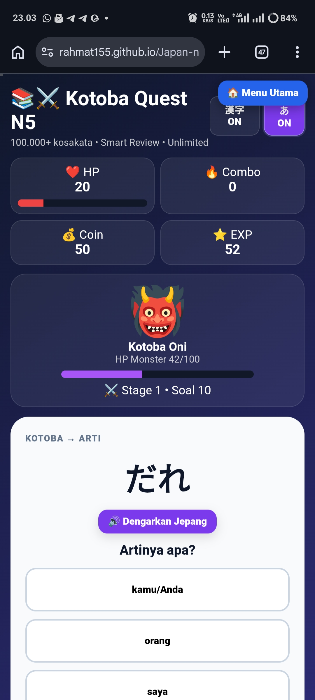
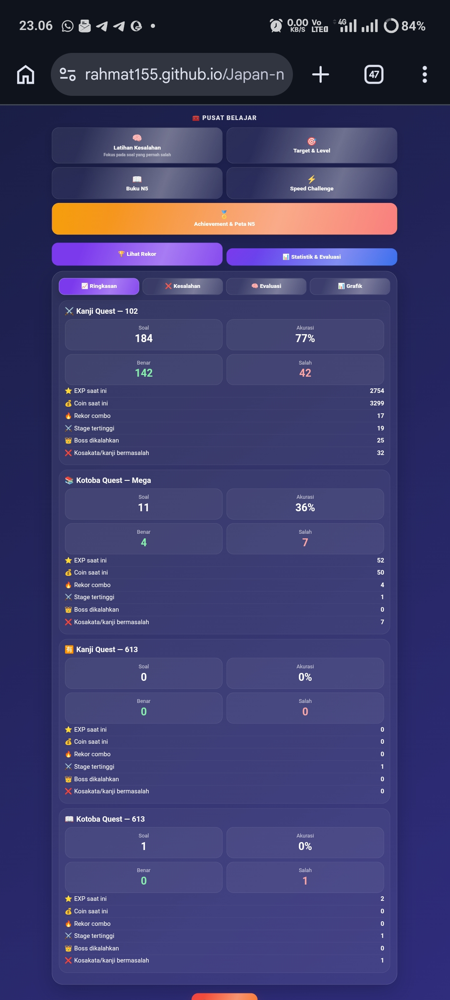
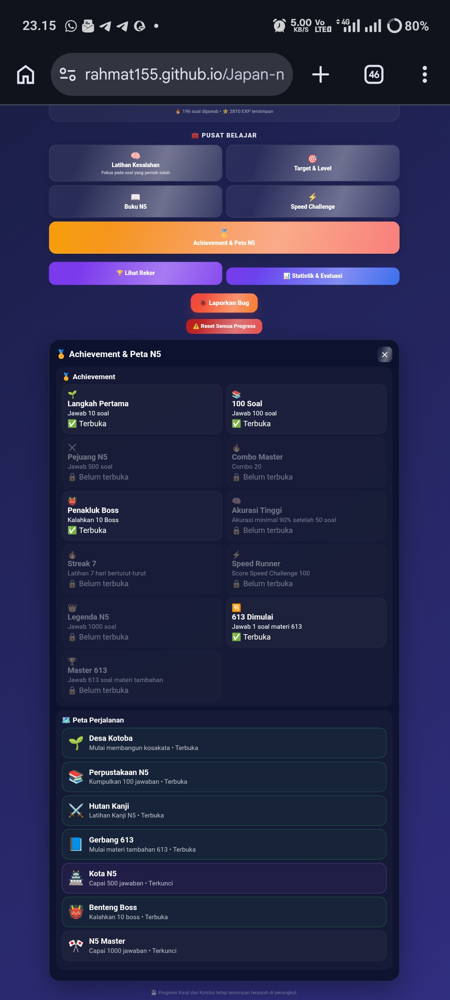

# 🇯🇵 JAPANESE QUEST N5

### ⚔️ INTERACTIVE JAPANESE LEARNING RPG

**Belajar Bahasa Jepang dengan cara yang lebih seru, interaktif, dan konsisten.**

🇮🇩 Indonesia → ✈️ → 🇯🇵 Jepang

**One Step Closer to Japan.**

 

  

<a href="https://rahmat155.github.io/Japan-n5-v10/">
  🎮 BUKA APLIKASI
</a>

---

# 🌸 Tentang Project

**Japanese Quest N5** adalah aplikasi pembelajaran Bahasa Jepang
berbasis web yang dibuat untuk membantu belajar **Kanji dan Kotoba**
dengan konsep yang berbeda dari latihan soal biasa.

Pembelajaran dikemas dalam konsep **RPG (Role-Playing Game)**,
sehingga proses belajar terasa seperti menjalankan sebuah petualangan.

Setiap latihan dapat memberikan:

> ⭐ EXP • 💰 Coin • 🔥 Combo • ❤️ HP • 👹 Monster • 👑 Boss • 🏆 Achievement

Tujuan project ini sederhana:

> **Belajar sedikit setiap hari, terus berkembang, dan selangkah lebih dekat menuju Jepang. 🇯🇵**

---

# 🎮 Fitur Utama

## ⚔️ Kanji Quest N5

Latihan Kanji dengan sistem RPG.

- 📚 Materi Kanji N5
- 🎯 Latihan soal interaktif
- ❤️ HP System
- 🔥 Combo System
- ⭐ EXP
- 💰 Coin
- 👹 Monster Battle
- 👑 Boss Battle
- 🧠 Smart Review
- 🔊 Audio pengucapan
- 📊 Progress belajar

---

## 📚 Kotoba Quest N5

Latihan kosakata Bahasa Jepang dengan berbagai mode soal.

### Mode latihan:

- 🇯🇵 Jepang → Indonesia
- 🇮🇩 Indonesia → Jepang
- 🈶 Kanji → Hiragana
- 🔤 Hiragana / Reading
- 🔊 Audio pengucapan

Kotoba juga memiliki sistem:

- 🧠 Smart Review
- 🔥 Combo
- ⭐ EXP
- 💰 Coin
- 👹 Battle
- 👑 Boss
- 📊 Statistik

Database Kotoba mendukung **100.000+ kosakata**.

---

# 📘 Materi Tambahan

## JFT A2 + Irodori

Selain materi N5, tersedia mode tambahan untuk latihan
**613 materi Kanji dan Kotoba**.

### 🈶 Kanji Quest 613

- 613 materi
- Reading Bahasa Jepang
- Arti Bahasa Indonesia
- Sistem RPG
- Progress terpisah
- Statistik terpisah

### 📖 Kotoba Quest 613

- 613 materi
- Latihan kosakata
- Reading
- Arti
- Audio contoh
- Smart Review
- Progress terpisah

> 🔒 **Database lama tetap aman.**
>
> Materi N5 dan materi 613 memiliki progress masing-masing.

---

# 🧠 Smart Review

Tidak hanya mengerjakan soal secara acak.

Japanese Quest membantu memfokuskan latihan pada
materi yang pernah mengalami kesalahan.

Cocok untuk:

- 🔁 Mengulang soal yang salah
- 🧠 Memperkuat ingatan
- 🎯 Fokus pada kelemahan
- 📈 Melihat perkembangan belajar

---

# 📊 Statistik & Evaluasi

Pantau perkembangan belajar melalui statistik.

### Statistik yang tersedia:

- 📚 Total soal
- ✅ Jawaban benar
- ❌ Kesalahan
- 🎯 Akurasi
- ⭐ Total EXP
- 💰 Coin
- 🔥 Combo terbaik
- 📅 Streak belajar
- 📈 Progress setiap materi
- 🧠 Evaluasi kesalahan
- 📊 Grafik perkembangan

---

# 🏆 Achievement

Setiap perkembangan dapat membuka pencapaian baru.

Contohnya:

- 🌱 Langkah Pertama
- 📚 100 Soal
- ⚔️ Pejuang N5
- 🔥 Combo Master
- 👹 Penakluk Boss
- 🧠 Akurasi Tinggi
- 🔥 Streak 7
- ⚡ Speed Runner
- 👑 Legenda N5
- 🈶 613 Dimulai
- 🏆 Master 613

Semakin rajin belajar, semakin banyak achievement
yang dapat dibuka. 🔥

---

# ⚡ Speed Challenge

Uji kemampuan Bahasa Jepang dengan mode latihan cepat.

⏱️ Jawab soal dalam batas waktu.

Cocok untuk melatih:

- ⚡ Kecepatan berpikir
- 🎯 Ketepatan
- 🧠 Penguasaan materi
- 🔥 Konsistensi

---

# 📖 Buku Belajar

Tersedia fitur **Buku** untuk melihat dan mencari kosakata.

Dapat digunakan untuk:

- 🔎 Mencari kata
- 🇯🇵 Melihat tulisan Jepang
- 🔤 Melihat reading
- 🇮🇩 Melihat arti
- 📊 Melihat status penguasaan
- 🌐 Pencarian tambahan

---

# 🔊 Audio Bahasa Jepang

Beberapa bagian aplikasi mendukung audio pengucapan
Bahasa Jepang.

Audio menggunakan pengucapan:

**Japanese — `ja-JP`**

Sehingga pengguna dapat sekaligus berlatih:

> 👀 Membaca → 👂 Mendengar → 🧠 Mengingat

---

# 📸 Tampilan Aplikasi

## 🏠 Menu Utama

---

## ⚔️ Kanji Quest

---

## 📚 Kotoba Quest

---

## 📊 Statistik & Evaluasi

---

## 🏆 Achievement

---

# 💾 Penyimpanan Progress

Progress belajar disimpan langsung pada perangkat menggunakan
**Local Storage**.

Progress dapat mencakup:

- ⭐ EXP
- 💰 Coin
- 🔥 Combo
- 📚 Soal yang sudah dikerjakan
- ❌ Kesalahan
- 🧠 Smart Review
- 🏆 Achievement
- 📈 Statistik
- 📅 Streak

Tidak perlu membuat akun untuk menggunakan aplikasi.

---

# 📱 Platform

Japanese Quest N5 merupakan aplikasi berbasis web.

| Platform | Dukungan |
|---|:---:|
| 📱 Android | ✅ |
| 📱 iPhone / iPad | ✅ |
| 💻 Windows | ✅ |
| 💻 macOS | ✅ |
| 🌐 Browser | ✅ |

Tidak perlu instal aplikasi.

### **Buka → Mainkan → Belajar. 🎮**

---

# 🚀 Demo

## 🇯🇵 Japanese Quest N5

### 🎮 [BUKA APLIKASI SEKARANG](https://rahmat155.github.io/Japan-n5-v10/)

**Gratis • Berbasis Web • Bisa langsung dimainkan**

---

# 📚 Materi Pembelajaran

Materi yang tersedia mencakup:

- 🇯🇵 Hiragana
- 🇯🇵 Katakana
- 🈶 Kanji N5
- 📚 Kotoba N5
- 🔤 Reading
- 🧠 Latihan Kanji
- 📖 Latihan Kotoba
- 📘 Materi tambahan JFT A2
- 🌸 Materi tambahan Irodori

---

# 🛠️ Teknologi

Project ini dibuat menggunakan:

- 🌐 HTML
- 🎨 CSS
- ⚙️ JavaScript
- 💾 Local Storage
- 🔊 Web Speech API
- 🚀 GitHub Pages

Tidak menggunakan framework besar.

Tujuannya agar aplikasi tetap ringan dan dapat berjalan langsung
di browser.

---

# 🎯 Tujuan Project

Project ini dibuat sebagai media belajar dan latihan
Bahasa Jepang tingkat N5.

Tujuan utamanya adalah membuat proses belajar menjadi
lebih interaktif sehingga belajar tidak terasa seperti
menghafal kosakata dan Kanji saja.

> **Belajar sedikit setiap hari lebih baik daripada belajar
> banyak sekali lalu berhenti.**

---

# 🗺️ Roadmap

### ✅ Sudah Tersedia

- [x] 🇯🇵 Kanji Quest N5
- [x] 📚 Kotoba Quest N5
- [x] ⚔️ Sistem RPG
- [x] ❤️ HP System
- [x] 🔥 Combo System
- [x] 👹 Monster Battle
- [x] 👑 Boss Battle
- [x] 🧠 Smart Review
- [x] 🏆 Achievement
- [x] 📊 Statistik & Evaluasi
- [x] ⚡ Speed Challenge
- [x] 🔊 Audio Bahasa Jepang
- [x] 📘 Materi 613
- [x] 📚 Kotoba 100.000+

### 🔮 Pengembangan Selanjutnya

- [ ] 💾 Backup & Import Progress
- [ ] 🎯 Daily Mission
- [ ] 📅 Weekly Challenge
- [ ] 🌙 Performance Mode
- [ ] 📈 Statistik belajar yang lebih lengkap
- [ ] 🏆 Achievement tambahan
- [ ] 🎮 Fitur RPG tambahan

---

# 💡 Filosofi

Belajar Bahasa Jepang bukan tentang siapa yang paling cepat.

Tetapi tentang siapa yang **tetap belajar ketika merasa sulit.**

> **一歩ずつ、日本へ。**
>
> *Ippo zutsu, Nihon e.*
>
> **Selangkah demi selangkah menuju Jepang. 🇯🇵**

---

# 🌸 Motivation

### 毎日少しずつ、日本語を勉強しよう！

**Belajar Bahasa Jepang sedikit demi sedikit setiap hari.**

 

🇮🇩 **Indonesia**

⬇️

✈️

⬇️

🇯🇵 **Japan**

### **One Step Closer to Japan.**

---

# 👨‍💻 Dibuat Oleh

## 🗿 Rahmat

### **Rahmat155**

Project ini dibuat oleh **Rahmat**
sebagai project pembelajaran, latihan, dan pengembangan
kemampuan Bahasa Jepang.

🇮🇩 **Indonesia**

⬇️

✈️

⬇️

🇯🇵 **Japan**

> **"Aku masih di Indonesia sekarang.
> Tapi setiap hari aku sedang berjalan menuju Jepang."**

---

# 📜 License

Project ini dibuat untuk keperluan pembelajaran,
pengembangan pribadi, dan latihan Bahasa Jepang.

© 2026 **Rahmat155**

---

### 🇯🇵 日本語を勉強しよう！

**Belajar sedikit setiap hari.**

 

⚔️ **JAPANESE QUEST N5** ⚔️

### Made with ❤️ & ☕ by Rahmat

